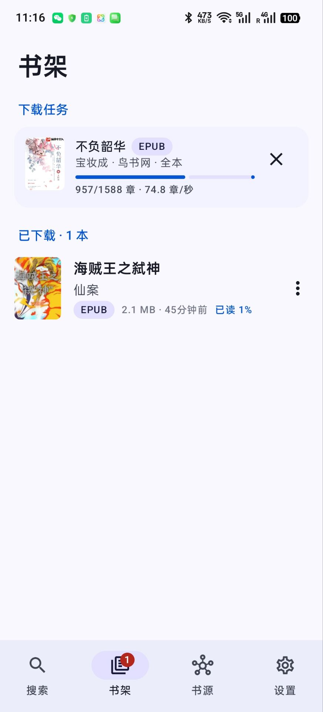

# So Novel for Android

[So Novel](https://github.com/freeok/so-novel) 的安卓原生移植版：聚合搜索网络小说，下载并导出为 EPUB / TXT / HTML / PDF，内置阅读器。

> 本项目参考开源项目 [freeok/so-novel](https://github.com/freeok/so-novel) 开发，书源规则与功能设计均来自原项目。

## 截图

| 搜索 | 书架 | 阅读器 |
| :---: | :---: | :---: |
|  |  |  |

## 功能

- **搜索**：聚合搜索（同时查询当前规则文件内全部书源，按相似度排序）或指定单个书源搜索；搜索建议、搜索历史
- **书籍详情**：封面（可从起点 / 纵横 / 七猫匹配高清封面）、简介、完整目录、章节试读
- **下载**：全本 / 指定章节范围 / 最新 N 章；可选导出格式、简繁转换、并发数；前台服务后台下载，失败自动重试，支持断点续传
- **导出格式**：EPUB（含封面与目录）、TXT（UTF-8 / GBK）、HTML（zip，含目录页）、PDF
- **内置阅读器**：左右翻页 / 上下滚动，目录跳转，字号、行距、背景主题（纸黄 / 护眼 / 夜间），自动记录阅读进度；支持 EPUB / TXT / HTML / PDF
- **批量下载**：按“书名 作者”批量匹配并下载
- **链接下载**：粘贴书籍详情页地址（适用于不支持搜索的书源），也可从浏览器分享链接到本应用
- **书源管理**：内置原项目全部规则文件，切换规则文件、启用 / 停用书源、连通性检测、导入自定义规则
- **设置**：覆盖原项目 `config.ini` 的全部适用项（请求间隔、重试、HTTP 代理、Cloudflare 绕过服务、起点 Cookie 等）
- 深色模式、Android 12+ 动态取色；兼容 Android 6.0 及以上

## 技术栈

Kotlin · Jetpack Compose (Material 3) · OkHttp · jsoup · QuickJS（执行书源规则中的 `@js:` 脚本）· OpenCC 词典（简繁转换）· Coil

## 构建

使用 Android Studio 打开项目，或命令行：

```bash
./gradlew assembleDebug
```

APK 输出在 `app/build/outputs/apk/debug/`。发布版签名：在项目根目录创建 `keystore.properties`（包含 `storeFile`、`storePassword`、`keyAlias`、`keyPassword`），然后执行 `./gradlew assembleRelease`。

## 免责声明

本应用仅供交流学习使用，所有内容均来自第三方网站，与本应用无关。请勿用于商业用途，请支持正版阅读。如有侵权，请联系删除。

## 许可证

与原项目一致，采用 [AGPL-3.0](LICENSE) 协议。
